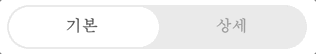
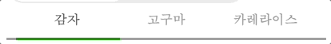
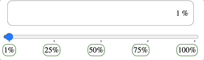
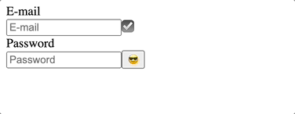
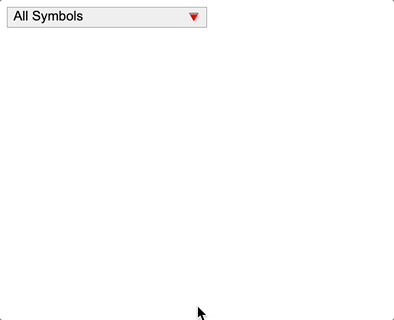

# 원티드 프리 온 보딩 코스

## Getting Started

```
npm install
npm run start
```

## 폴더 구조

```
/src
  App.js
  /components
    Toggle.js
    Tab.js
    Slider.js
    Input.js
    Dropdown.js
```

## 주요 컴포넌트

### Toggle.js



- 핵심 기능 : `input`의 `radio` 사용
- 부가 기능 : 별도의 slider UI를 구현

- comment

  - 동작 방식으로 `input`의 `radio`가 적합하다고 생각해서 위와 같은 구현 방법을 택했다.
  - 이렇게 구현한 경우, 예시처럼 좌우로 움직이며 토글되는 애니메이션을 어떻게 구현할 지 고민했고, 토글에 활용될 별도의 UI를 만드는 방법으로 구현했다.
  - 예시의 경우 토글 항목이 2가지여서 각각에 대해 translateX를 지정해주는 것으로 구현이 가능하지만, 항목이 많아질 경우를 생각하면 조금 더 최적화된 방법으로 구현해야 할 것 같다.

- Q. 별도의 UI를 구현하는게 바람직한 접근일까? 아니라면 또 어떤 방법을 쓸 수 있을까?

### Tab.js



- 핵심 기능 : `input`의 `radio` 사용
- 부가 기능 : 별도의 slider를 구현

- comment

  - Toggle.js와 같은 방식으로 구현했다.
  - 다만 이 경우는 항목이 3개여서 코드가 조금 더 길어졌다. 항목이 점점 더 많아질 경우 자료구조를 활용해 코드를 간략화할 필요가 있어 보이고, 역시 다른 방법이 있을지 고민할 필요가 있어 보였다.

- Q. 별도의 UI를 구현하는게 바람직한 접근일까? 아니라면 또 어떤 방법을 쓸 수 있을까?

### Slider.js



- 핵심 기능 : `input`의 `range` 사용. `useState` 활용해 값 표시
- 부가 기능 : `datalist` 사용해 범위 표시

- comment

  - `range`타입을 활용하기 좋은 예시라고 생각해 이 방법을 택했는데, react로 `range`를 직접 구현해보는 것도 공부가 될 것 같다.
  - 먼저 값을 통제하기 위해 `useState`를 사용해 `input`의 `value`이 상태에 따라 갱신되도록 지정해주었다.
  - 예시처럼 슬라이더를 움직이는 경우는 `range`의 특성과 `useState`를 활용해 값을 갱신했다.
  - 그리고 아래 버튼을 선택해 값을 갱신하는 경우는 `onClick`이벤트와 `useState`를 활용했다.

- Q. 하단 픽셀 버튼을 `flex`를 활용해 배치했는데 의도에 맞는 접근일까?

### Input.js



- 핵심 기능 : `input`의 `text`, `password` 사용. 정규표현식으로 이메일 확인
- 부가 기능 : `useState`, `useEffect`를 활용해 이메일 검증 및 비밀번호 표시 구현. 삼항 연산자 활용

- comment

  - `input`의 타입을 적절히 지정해 email과 password 값을 받도록 구현했다.
  - `handleEmail`, `checkValid`를 구현해 인풋 포커스 상태에 따라 이메일을 검증하도록 구현했다.
  - 예시처럼 이메일 검증됨 ✅ 표시는 입력 중 갱신되도록 구현했고, 인풋 아래에 뜨는 Invald 텍스트는 포커스에서 벗어났을 때 보이도록 구현했다.
  - 적절한 상태 관리를 위해 `useEffect`를 활용했다.
  - 이메일 검증, 비밀번호 표시는 삼항 연산자를 활용해 상황에 따른 UI가 보이도록 구현했다.

- Q. `onFocus()`, `onBlur()`를 활용해 포커스를 벗어난 상태를 관리. 보편적인 접근일까?

### Dropdown.js



- 핵심 기능 : `input`의 `text` 사용. `useState` 활용해 선택한 값 표시
- 부가 기능 : `filter`, `map`을 활용해 필터링 구현

- comment

  - 단축평가와 `useState`를 활용해 드롭박스를 펼치고 닫을 수 있게 구현했다.
  - `map`을 활용해 `dataList` 배열에 담겨있는 값을 동적으로 드롭다운박스에 넣도록 구현했다.
  - `filter`와 `includes`를 활용해 키워드 필터 기능을 구현했다.

- \+ ) 필터링된 키워드 하이라이트 기능, 키보드 조작을 구현하면 좋을 것 같다.
